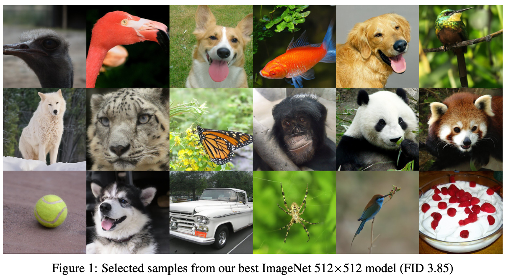
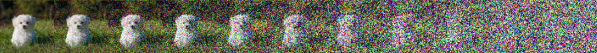
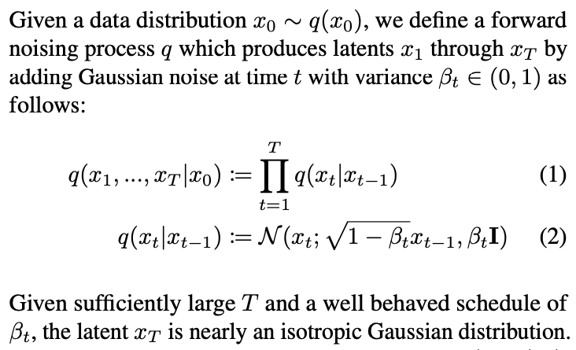
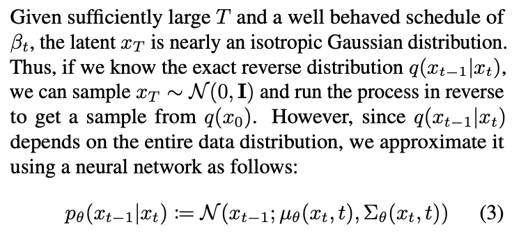
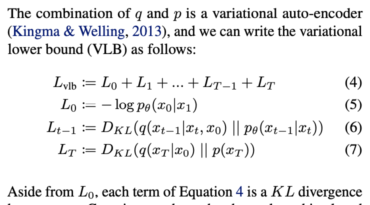
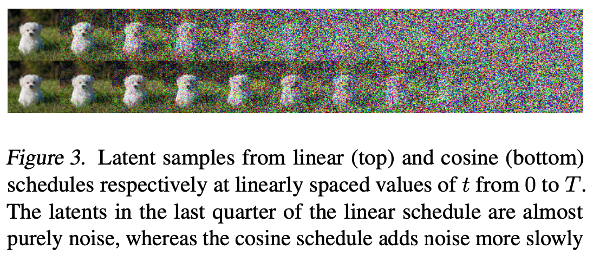
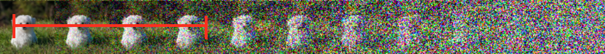

# Denoising Diffusion Probabilistic Models

---

## Authors

### Prafulla Dhariwal & Alex Nichol 

### open.ai

--

## Resources

[paper 2](https://arxiv.org/pdf/2105.05233.pdf)

[paper 1](https://arxiv.org/pdf/2102.09672.pdf)

[github](https://github.com/openai/guided-diffusion)

[blog post](https://lilianweng.github.io/lil-log/2021/07/11/diffusion-models.html)

[blog post](https://yang-song.github.io/blog/2021/score/)

--

### Later paper: ARXIV 

This is a large document: 44 pages!

###  Previous paper: ICLR 2021 REJECT

[Reviews](https://openreview.net/forum?id=-NEXDKk8gZ)

---

--

Fréchet inception distance (FID) : a distance between two distributions.

--

Claim: Better than GANs for image synthesis.

Claim: Improvements over previous work.

--

## Denoising Diffusion Probabilistic Models

One of a class of Generative models.

--

--

$$ x_1, x_2, ..., x_n \rightarrow x_n \approx N $$

Over a number of function steps the image becomes normally distributed noise.

This defines a process from the image space to a normal distribution.

--

What if we could invert this mapping?

For a noisy image - what is the original image?

--

This requires some understanding of an image, i.e:

(most of) the image information is retained but we remove (most of) the noise.

--

$$ f(x, t) \rightarrow x_{t-1}$$

don't need to train a function for every step...

--

repeat $x = f(x, t)$ for all $t$.

allows us to invert the process from a normal distribution to an image...

--

--

return a *distribution* where $x_t$ could have come from

--

Loss is the distance between the image distribution and the data distribution

--

In practice, they model the noise, rather than the image.

Previous authors don't model the covariance, but fix it to $\sigma^{2}I$.

---

## Improvements over prior work

--

## Log likelihood

Increase the number of steps from 1000 to 4000!

--

## Noise Schedule

move from clean image to noisy image more gradually

--

## Importance Sampling

far greater losses when training for these steps.

---

# Diffusion Models Beat GANs

--

### U-net Architecture

A different architecture improves the results.

--

If data has class labels, then they can condition a diffusion model on the class.

---

## Evaluation

--

## Fréchet inception distance (FID)

1. Using a pre-trained Inception 3 model, remove the last layer.
2. Compute the 2048 Dense layer output of the last layer, for real and generated images.
3. Compute the FID between these two outputs:
    $$d^2 = ||\mu_x – \mu_y||^2 + Tr\[ ~ \Sigma_x + \Sigma_y ~ – 2 ~ \Sigma_x \Sigma_y ~ \]$$

[GANs Trained by a Two Time-Scale...](https://arxiv.org/abs/1706.08500)

--

## Log likelihood

KL divergence between the two distributions

zero if they are the same

--

Many ways of evaluating GANs:

[Pros and Cons of Gan Evaluation](https://arxiv.org/pdf/1802.03446.pdf)

---

# Elephant in the room

computationally much more expensive

---

Also used for synthesising audio waveforms:

    https://arxiv.org/abs/2009.09761

and more...

---

Questions